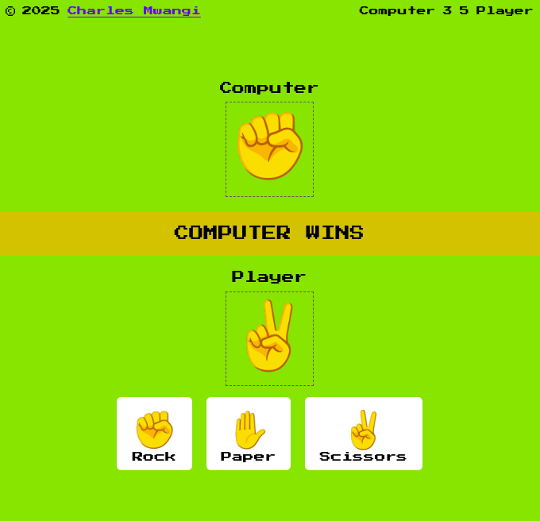

# Rock Paper Scissors Game 🎮✊🖐✌️

A simple and responsive Rock-Paper-Scissors game built using **HTML**, **CSS**, and **JavaScript**, scaffolded with **Vite** for a fast and modern development setup.



[Live Demo](./src/image/game-UI.png)


## 🛠️ Features

- Computer randomly selects rock, paper, or scissors.
- User can interact with the user interface to select either rock, paper or scissors.
- Results displayed instantly (player wins, computer wins, draw).
- Responsive design using media queries for different screen sizes.
- Powered by [Vite](https://vitejs.dev/) for fast development.

## Getting Started

To run this project locally:

### Step 1: Clone the repo

```bash
git clone https://github.com/charles-254/rock-paper-scissors.git
```

### Step 2: Navigate into the project folder

```bash
cd rock-paper-scissors
```

### Step 3: Install dependencies

```bash
npm install
```

### Step 4: Run the development server

```bash
npm run dev
```